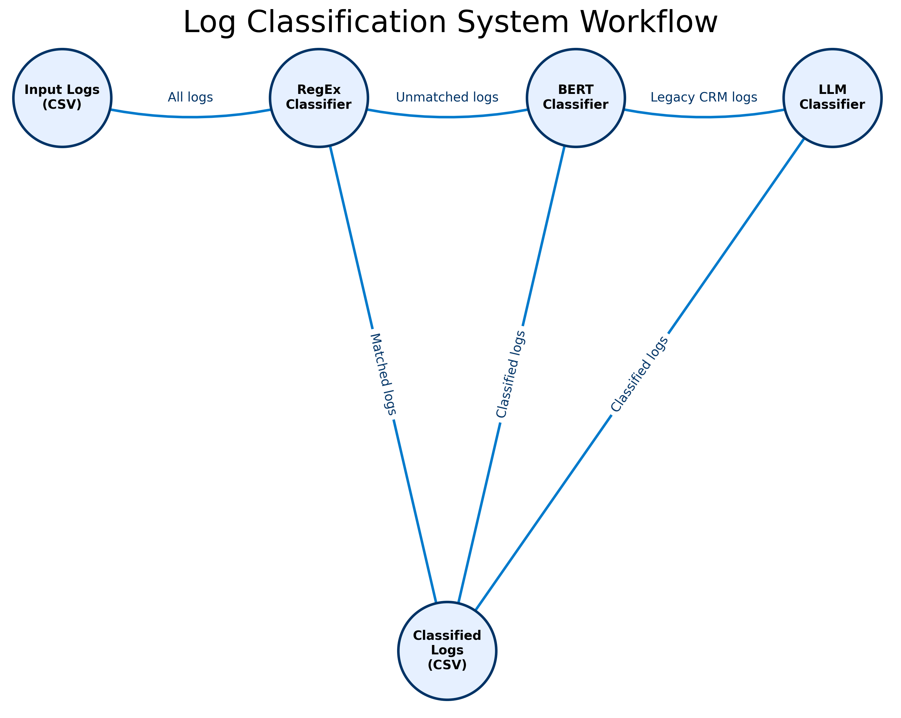

# Log Classification System

## Overview
This project implements a hybrid log classification system designed to categorize software logs into functional categories for enhanced monitoring and issue detection. It replicates an industry-grade solution developed for a client at Atliq Technologies, adapted here with synthetic data. The system leverages a combination of regular expressions, BERT-based logistic regression, and large language models (LLMs) to classify logs efficiently and accurately.

## Project Purpose
The system addresses the following business problems for a fictional company, "KOHO" which develops software products like CRMs and HR systems:
- **Delayed Issue Detection**: Lack of proactive log monitoring leads to delayed responses to exceptions or server crashes.
- **Inefficient Debugging**: Programmers spend hours manually sifting through logs to identify issues.
- **Weak Security**: Inadequate log monitoring fails to detect cybersecurity threats promptly.

The log classification system categorizes logs into functional categories (e.g., security alerts, resource usage, workflow errors) to enable proactive monitoring, faster debugging, and improved security. This project serves as the classification component, which can integrate with tools like Splunk for full log monitoring.

## Technical Architecture
The hybrid classification system follows a cascading approach:
1. **Regular Expression (RegEx) Classification**:
   - Identifies fixed patterns in logs (e.g., "user logged in/out") using Python's `re` module.
   - Fast and cost-effective for common patterns.
2. **BERT-based Classification**:
   - Uses Sentence Transformers to generate embeddings for logs with sufficient training samples.
   - Applies logistic regression (`scikit-learn`) for classification.
   - Suitable for complex patterns with adequate data.
3. **LLM-based Classification**:
   - Utilizes Deepseek R1 (via Grok Cloud) for logs with insufficient training samples (e.g., legacy CRM logs).
   - Employs few-shot learning with tailored prompts for accurate classification.

### Workflow
- **Input**: Aggregated logs in CSV format with columns for timestamp, source, log message, and target label.
- **Processing**:
  - Logs are first processed by the RegEx classifier.
  - If no pattern is matched, the system checks the log's source and training sample availability.
  - Logs with sufficient samples go to BERT-based classification; others are processed by the LLM.
- **Output**: Classified logs with functional category labels (e.g., security alert, user action).

### Benefits
- **Cost Optimization**: RegEx minimizes costly LLM usage; BERT balances accuracy and efficiency.
- **High Accuracy**: Tailored methods ensure precise classification for different log types.
- **Scalability**: Hybrid approach supports scaling from thousands to millions of logs daily.

## Workflow Diagram

Below is the workflow diagram for the hybrid log classification system:



The diagram illustrates the cascading approach of RegEx, BERT, and LLM-based classification, starting from input logs and ending with classified logs.

## Folder Structure
```
LogClassificationSystem/
├── app.py                     # FastAPI application with endpoints for log classification
├── classify.py                # Main classification script
├── main.py                    # Script for testing classification on sample CSV
├── processor_bert.py          # BERT-based classification logic
├── processor_llm.py           # LLM-based classification logic
├── processor_regex.py         # RegEx classification logic
├── README.markdown            # Project documentation
├── README.md                  # Placeholder README file
├── requirements.txt           # Python dependencies
├── assets/                    # Folder for input/output CSV files
│   ├── output.csv             # Output CSV after classification
│   └── test.csv               # Input CSV for testing
├── models/                    # Folder for pre-trained models
│   └── log_classifier_LR_model.joblib # Logistic regression model for BERT embeddings
├── training/                  # Folder for training-related files
│   └── training.ipynb         # Jupyter notebook for model training
└── dataset/                   # Folder for datasets
    └── synthetic_logs.csv     # Synthetic log data
```

## Setup Instructions
1. **Clone the Repository**:
   ```bash
   git clone https://github.com/Pramod-Pasala/LogClassificationSystem.git
   cd LogClassificationSystem
   ```

2. **Install Dependencies**:
   Ensure Python 3.10 is installed, then install required packages:
   ```bash
   pip install -r requirements.txt
   ```

3. **Set Up Environment Variables**:
   Create a `.env` file in the root directory and add your Grok API key:
   ```
   GROK_API_KEY=your_grok_api_key
   ```
   Obtain the key from [console.grok.com](https://console.grok.com).

4. **Download Pre-trained Models**:
   The Sentence Transformer model (`all-MiniLM-L6-v2`) is automatically downloaded when running the code.

5. **Prepare Data**:
   Place your log data in `dataset/synthetic_logs.csv`

## Usage

### Running the FastAPI Server

To start the FastAPI server, follow these steps:

1. Ensure all dependencies are installed:
   ```bash
   pip install -r requirements.txt
   ```

2. Run the FastAPI server:
   ```bash
   uvicorn app:app --reload
   ```

3. Access the API documentation:
   - Open your browser and navigate to `http://127.0.0.1:8000/docs` for the Swagger UI.
   - Alternatively, visit `http://127.0.0.1:8000/redoc` for ReDoc documentation.

The server will be running locally on port 8000, and you can use the provided endpoints for log classification.

### Running the Classification Script
Classify logs in a CSV file:
```bash
python classify.py
```
This processes `resources/test.csv` and outputs `resources/output.csv` with an additional `target_label` column.

### Training the Model
Explore and train the BERT model using the Jupyter notebook:
```bash
jupyter notebook training/training.ipynb
```
This notebook includes:
- Data loading and exploration.
- Clustering logs with DBSCAN to identify RegEx patterns.
- Training the logistic regression model with BERT embeddings.
- Exporting the trained model to `models/log_classifier.joblib`.

## Features

### API Endpoints

The project includes a FastAPI application with the following endpoints:

1. **`/classify-log/` (POST)**:
   - Classifies a single log message.
   - Accepts two form parameters:
     - `source`: The source of the log (e.g., "LegacyCRM").
     - `log_message`: The log content to classify.
   - Returns a JSON response with the `source`, `log_message`, and the predicted `label`.

   Example Request:
   ```bash
   curl -X POST "http://127.0.0.1:8000/classify-log/" \
        -F "source=LegacyCRM" \
        -F "log_message=Case escalation for ticket ID 7324 failed because the assigned support agent is no longer active."
   ```

   Example Response:
   ```json
   {
       "source": "LegacyCRM",
       "log_message": "Case escalation for ticket ID 7324 failed because the assigned support agent is no longer active.",
       "label": "Workflow Error"
   }
   ```

2. **`/classify-csv/` (POST)**:
   - Processes a CSV file containing logs and classifies each log entry.
   - Accepts a file upload (`file` parameter).
   - Returns the classified CSV file as a downloadable response.

   Example Request:
   ```bash
   curl -X POST "http://127.0.0.1:8000/classify-csv/" \
        -F "file=@test.csv"
   ```

   Example Response:
   A downloadable CSV file with an additional `label` column for each log entry.

## Notes
- **Grok API Limits**: The free Grok API has rate limits. Monitor usage at [console.grok.com](https://console.grok.com).
- **Synthetic Data**: The provided dataset is synthetic but mimics real-world logs. Replace with your data as needed.
- **Extensibility**: Modify `processor_regex.py` to add new patterns or update `processor_llm.py` for different LLM prompts. This allows the system to adapt to new log types or classification requirements.

## Contributing
Feel free to submit issues or pull requests for improvements. Ensure code follows PEP 8 standards and includes tests.

## License
This project is licensed under the MIT License.

## Acknowledgments
- Inspired by a real-world project at Atliq Technologies.
- Uses open-source models from Sentence Transformers and Grok Cloud.
- Special thanks to [Codebasics](https://www.youtube.com/@codebasics) for the tutorial that inspired this project.